# MhatIoT Architecture

## Overview

MhatIoT is a modern IoT data analytics platform that provides a Google-like interface for querying and analyzing sensor data. The system is designed to be intuitive, responsive, and powerful, focusing on user experience while handling complex data processing under the hood.

## System Architecture

### High-Level Overview

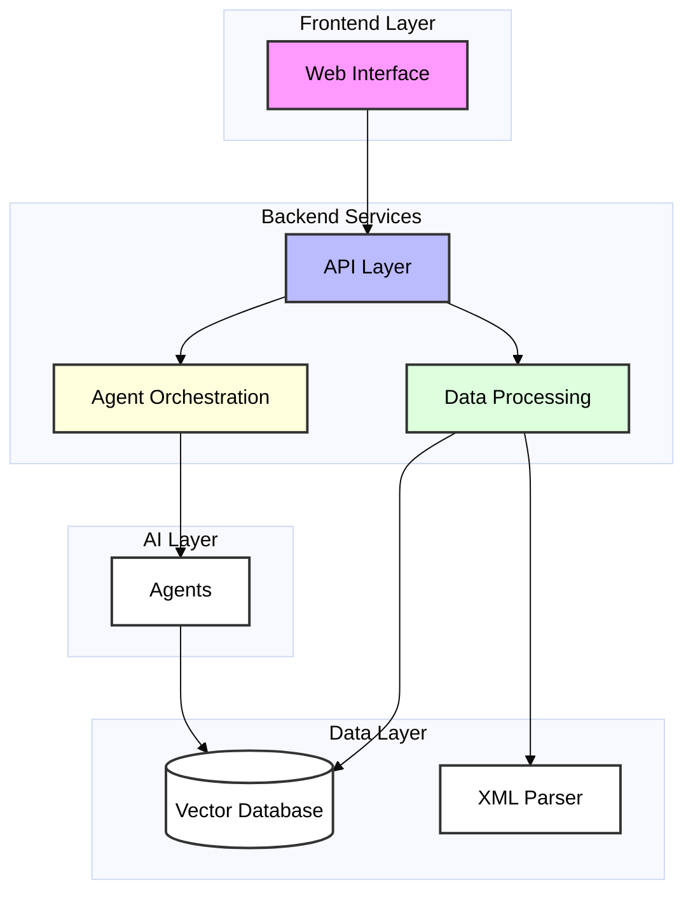

## Component Details

### 1. Frontend Interface

The frontend is built with Next.js and follows Google's search interface design principles:

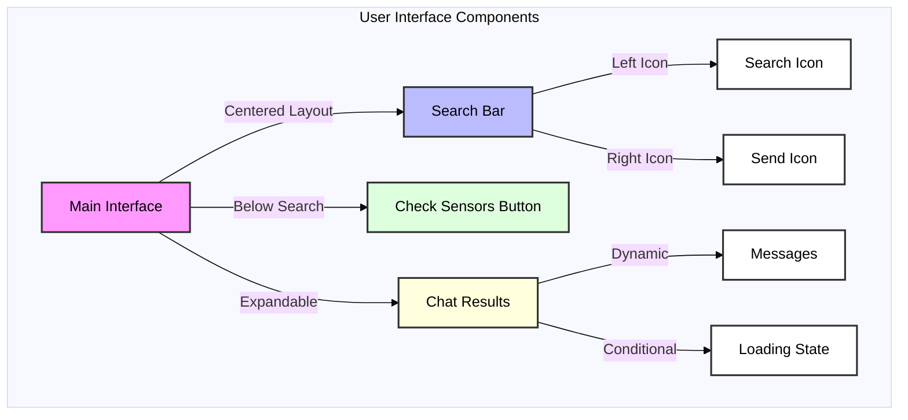

Key Features:
- Centered, Google-like search interface
- Expandable chat interface
- Responsive design
- Smooth transitions and animations
- Loading states and feedback

### 2. Data Processing Pipeline

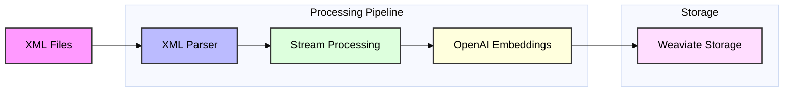

Components:
- XML Parser for handling large network data files
- Streaming processing for efficient memory usage
- Vector embeddings for semantic search
- Weaviate for vector storage and retrieval

### 3. Agent Orchestration

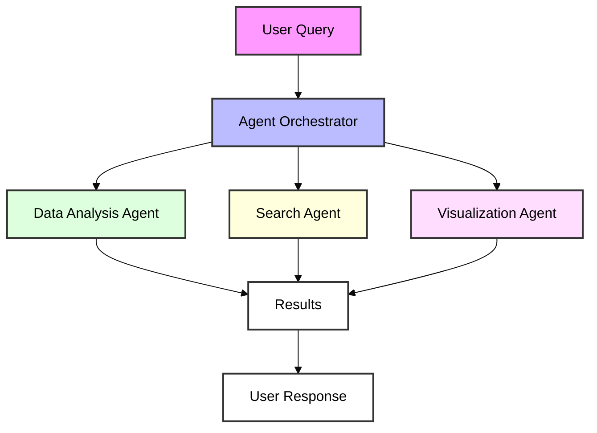

Features:
- LangGraph for agent workflow management
- Specialized agents for different tasks
- Zod schemas for data validation
- Semantic search capabilities

## Implementation Details

### Key Files and Their Roles

1. `client/app/page.tsx`
   - Main interface component
   - Google-inspired search UI
   - Chat interface integration

2. `client/lib/data-processor.ts`
   - XML parsing logic
   - Vector database operations
   - Stream processing implementation

3. `client/lib/agents/orchestrator.ts`
   - Agent workflow management
   - Query routing and processing
   - Response generation

### Technology Stack

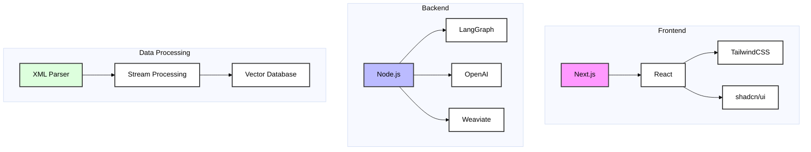

## Error Handling and Reliability

- Type safety throughout the application
- Proper error handling in data processing
- Loading states and user feedback
- Fallback mechanisms for failed operations

## Future Considerations

1. Scaling the vector database for larger datasets
2. Adding more specialized AI agents
3. Implementing real-time sensor data updates
4. Enhanced visualization capabilities
5. User authentication and access control

## Intelligent Analytics System

### Analytics Selection Flow

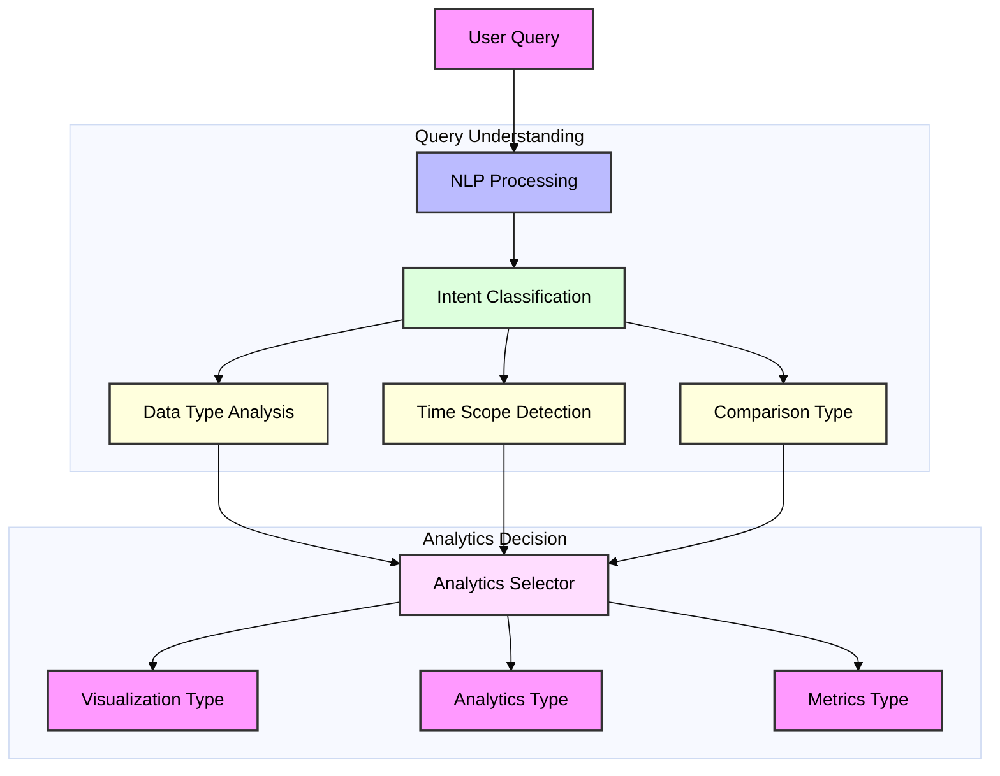

### Analytics Type Selection Matrix

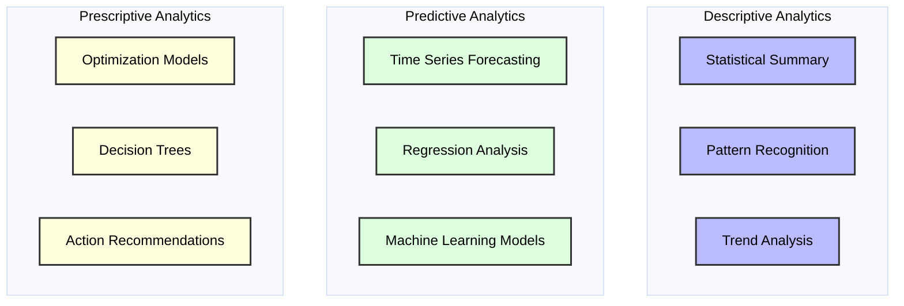

### Visualization Selection Logic

```typescript
// visualization-selector.ts
interface AnalyticsContext {
  dataType: 'numerical' | 'categorical' | 'temporal' | 'geographical';
  timeScope: 'instant' | 'period' | 'trend';
  comparison: 'single' | 'multiple' | 'distribution';
  dimensionality: number;
}

interface VisualizationRecommendation {
  type: string;
  confidence: number;
  configuration: Record<string, any>;
}

class VisualizationSelector {
  private rules: Map<string, (ctx: AnalyticsContext) => number>;

  constructor() {
    this.rules = new Map([
      ['bar', this.evaluateBarChart],
      ['line', this.evaluateLineChart],
      ['pie', this.evaluatePieChart],
      ['map', this.evaluateMapChart],
      ['scatter', this.evaluateScatterPlot],
      ['heatmap', this.evaluateHeatmap],
    ]);
  }

  recommend(context: AnalyticsContext): VisualizationRecommendation {
    let bestScore = 0;
    let bestType = 'bar'; // default

    this.rules.forEach((evaluator, type) => {
      const score = evaluator(context);
      if (score > bestScore) {
        bestScore = score;
        bestType = type;
      }
    });

    return {
      type: bestType,
      confidence: bestScore,
      configuration: this.getConfiguration(bestType, context)
    };
  }

  private evaluateBarChart(ctx: AnalyticsContext): number {
    let score = 0;
    if (ctx.dataType === 'categorical' || ctx.dataType === 'numerical') score += 0.5;
    if (ctx.comparison === 'multiple') score += 0.3;
    if (ctx.dimensionality <= 2) score += 0.2;
    return score;
  }

  // ... similar evaluation methods for other chart types
}
```

### Data Processing Pipeline

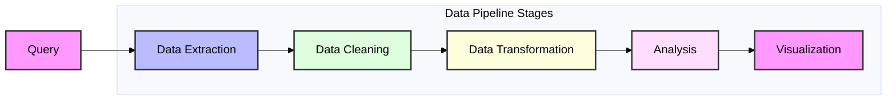

### Weaviate Query Generation

```typescript
// query-generator.ts
interface QueryContext {
  intent: string;
  dataType: string;
  timeRange?: { start: Date; end: Date };
  metrics: string[];
  filters: Record<string, any>;
}

class WeaviateQueryGenerator {
  generateQuery(context: QueryContext): string {
    const baseQuery = `
    {
      Get {
        SensorData(
          ${this.generateFilters(context)}
        ) {
          ${this.generateFields(context)}
        }
      }
    }`;

    return baseQuery;
  }

  private generateFilters(context: QueryContext): string {
    const filters = [];
    
    if (context.timeRange) {
      filters.push(`
        where: {
          operator: And,
          operands: [
            { path: ["timestamp"], operator: GreaterThanEqual, valueDate: "${context.timeRange.start}" },
            { path: ["timestamp"], operator: LessThanEqual, valueDate: "${context.timeRange.end}" }
          ]
        }
      `);
    }

    // Add other filters based on context
    return filters.join(',\n');
  }

  private generateFields(context: QueryContext): string {
    return context.metrics.join('\n');
  }
}
```

### Analytics Processing Pipeline

```typescript
// analytics-processor.ts
interface AnalyticsRequest {
  query: string;
  context: QueryContext;
  visualizationType: string;
}

interface ProcessedData {
  raw: any[];
  processed: any[];
  metadata: Record<string, any>;
  visualization: VisualizationRecommendation;
}

class AnalyticsProcessor {
  async process(request: AnalyticsRequest): Promise<ProcessedData> {
    // 1. Extract data from Weaviate
    const rawData = await this.queryWeaviate(request.query);

    // 2. Clean and transform data
    const cleanData = this.cleanData(rawData);
    const transformedData = this.transformData(cleanData, request.context);

    // 3. Apply analytics
    const analyticsResult = await this.applyAnalytics(
      transformedData,
      request.context
    );

    // 4. Prepare visualization
    const vizConfig = this.prepareVisualization(
      analyticsResult,
      request.visualizationType
    );

    return {
      raw: rawData,
      processed: analyticsResult,
      metadata: this.extractMetadata(analyticsResult),
      visualization: vizConfig
    };
  }

  private async queryWeaviate(query: string): Promise<any[]> {
    const client = weaviate.client({
      scheme: 'http',
      host: 'localhost:8080',
    });

    const result = await client.graphql.get(query).do();
    return result.data.Get.SensorData;
  }

  private cleanData(data: any[]): any[] {
    return data.filter(item => {
      // Remove nulls, undefined, and invalid values
      return item && this.isValidSensorData(item);
    }).map(item => {
      // Normalize data formats
      return {
        ...item,
        timestamp: new Date(item.timestamp),
        value: Number(item.value)
      };
    });
  }

  private transformData(data: any[], context: QueryContext): any[] {
    // Apply transformations based on analytics type
    switch (context.intent) {
      case 'trend':
        return this.aggregateByTime(data);
      case 'comparison':
        return this.pivotData(data);
      case 'distribution':
        return this.calculateDistribution(data);
      default:
        return data;
    }
  }

  private async applyAnalytics(
    data: any[],
    context: QueryContext
  ): Promise<any[]> {
    switch (context.intent) {
      case 'predict':
        return this.applyPredictiveAnalytics(data);
      case 'prescribe':
        return this.applyPrescriptiveAnalytics(data);
      case 'describe':
        return this.applyDescriptiveAnalytics(data);
      default:
        return data;
    }
  }
}
```

### Frontend Visualization Component

```typescript
// visualization-component.tsx
import { useEffect, useRef } from 'react';
import * as d3 from 'd3';

interface VisualizationProps {
  data: ProcessedData;
  config: VisualizationRecommendation;
}

export const DynamicVisualization: React.FC<VisualizationProps> = ({
  data,
  config
}) => {
  const svgRef = useRef<SVGSVGElement>(null);

  useEffect(() => {
    if (!svgRef.current) return;

    // Clear previous visualization
    d3.select(svgRef.current).selectAll('*').remove();

    // Create new visualization based on type
    switch (config.type) {
      case 'bar':
        createBarChart(data, config, svgRef.current);
        break;
      case 'line':
        createLineChart(data, config, svgRef.current);
        break;
      case 'pie':
        createPieChart(data, config, svgRef.current);
        break;
      // ... other chart types
    }
  }, [data, config]);

  return (
    <div className="visualization-container">
      <svg ref={svgRef} width="100%" height="100%" />
    </div>
  );
};

function createBarChart(
  data: ProcessedData,
  config: VisualizationRecommendation,
  container: SVGSVGElement
) {
  const margin = { top: 20, right: 20, bottom: 30, left: 40 };
  const width = container.clientWidth - margin.left - margin.right;
  const height = container.clientHeight - margin.top - margin.bottom;

  const x = d3.scaleBand()
    .range([0, width])
    .padding(0.1);

  const y = d3.scaleLinear()
    .range([height, 0]);

  const svg = d3.select(container)
    .append('g')
    .attr('transform', `translate(${margin.left},${margin.top})`);

  // Set domains
  x.domain(data.processed.map(d => d.label));
  y.domain([0, d3.max(data.processed, d => d.value)]);

  // Add bars
  svg.selectAll('.bar')
    .data(data.processed)
    .enter().append('rect')
    .attr('class', 'bar')
    .attr('x', d => x(d.label))
    .attr('width', x.bandwidth())
    .attr('y', d => y(d.value))
    .attr('height', d => height - y(d.value));

  // Add axes
  svg.append('g')
    .attr('transform', `translate(0,${height})`)
    .call(d3.axisBottom(x));

  svg.append('g')
    .call(d3.axisLeft(y));
}
```

### Analytics Selection Process

```mermaid
%%{init: {'theme': 'base', 'themeVariables': { 'fontFamily': 'arial', 'fontSize': '16px', 'textColor': '#000000' }}}%%
sequenceDiagram
    participant U as User
    participant Q as Query Analyzer
    participant W as Weaviate
    participant P as Processor
    participant V as Visualizer

    U->>Q: Submit Query
    Q->>Q: Analyze Intent
    Q->>Q: Determine Analytics Type
    Q->>W: Generate & Execute Query
    W->>P: Raw Data
    P->>P: Clean & Transform
    P->>P: Apply Analytics
    P->>V: Processed Data
    V->>V: Select Visualization
    V->>U: Render Result

    style U fill:#f9f,stroke:#333,stroke-width:2px,color:#000
    style Q fill:#bbf,stroke:#333,stroke-width:2px,color:#000
    style W fill:#dfd,stroke:#333,stroke-width:2px,color:#000
    style P fill:#ffd,stroke:#333,stroke-width:2px,color:#000
    style V fill:#fdf,stroke:#333,stroke-width:2px,color:#000
```

This comprehensive system:
1. Analyzes user queries to determine intent and required analytics
2. Selects appropriate visualization types based on data characteristics
3. Generates optimized Weaviate queries
4. Processes data through cleaning and transformation pipelines
5. Applies the selected analytics methods
6. Renders dynamic visualizations using D3.js

The implementation includes:
- Type-safe interfaces and classes
- Modular and extensible architecture
- Comprehensive data processing pipeline
- Dynamic visualization generation
- Error handling and data validation

Would you like me to expand on any particular aspect of this system?

## Database Construction Strategy

### Overview

The database architecture is designed to efficiently handle Marktstammdatenregister data with a focus on renewable energy facilities in Brandenburg. The system uses a multi-database approach to optimize different types of queries and analysis.

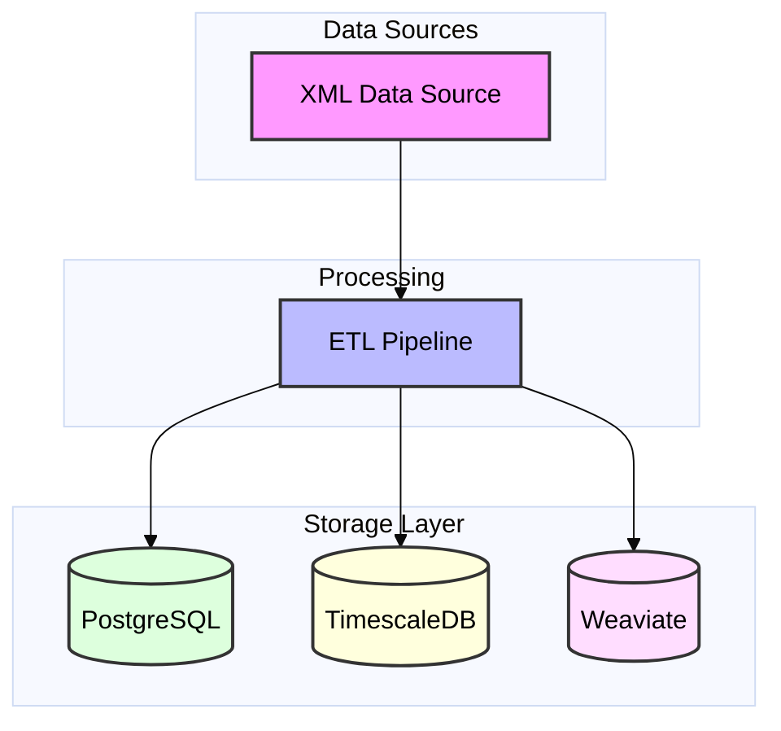

### Database Components

1. **PostgreSQL (Primary Storage)**
   - Core relational data storage
   - Normalized schema for energy facilities
   - Geospatial extensions (PostGIS) for location queries
   - Reference data (municipalities, grid operators)
   
2. **TimescaleDB (Time Series Data)**
   - Historical performance metrics
   - Capacity utilization data
   - Weather correlation data
   - Automated data retention policies
   
3. **Weaviate (Vector Database)**
   - Semantic search capabilities
   - Facility descriptions and metadata
   - Complex relationship mapping
   - AI-powered similarity queries

### Schema Design

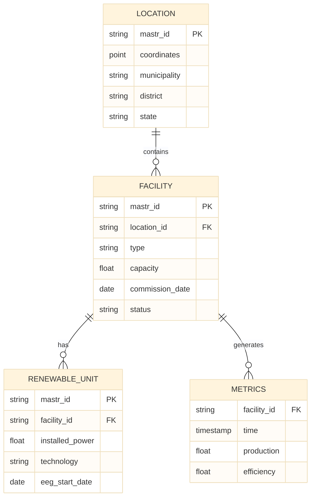

### ETL Pipeline

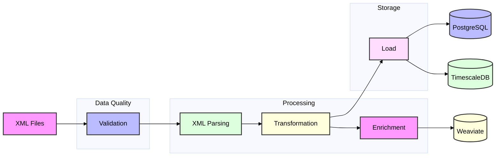

### Data Processing Steps

1. **XML Validation & Parsing**
   - Schema validation against XSD
   - Streaming XML parser for memory efficiency
   - Error logging and recovery
   
2. **Data Transformation**
   - Coordinate system conversion
   - Unit standardization
   - Data type conversion
   - Brandenburg region filtering
   
3. **Data Enrichment**
   - Geocoding and reverse geocoding
   - Municipality boundary mapping
   - Grid connection point correlation
   - Weather data integration
   
4. **Data Loading**
   - Batch loading for historical data
   - Real-time updates for new entries
   - Transaction management
   - Data versioning

### Query Optimization

1. **Spatial Queries**
   - PostGIS indexes for location-based queries
   - R-tree indexing for boundary searches
   - Spatial clustering for heat maps
   
2. **Time Series Analysis**
   - Automated partitioning in TimescaleDB
   - Continuous aggregates for common metrics
   - Retention policies for historical data
   
3. **Semantic Search**
   - Vector embeddings for facility descriptions
   - Similarity-based facility matching
   - Contextual search capabilities

### Example Queries

1. **Renewable Energy Potential**
```sql
WITH municipality_stats AS (
    SELECT 
        l.municipality,
        COUNT(f.mastr_id) as facility_count,
        SUM(r.installed_power) as total_capacity,
        AVG(m.efficiency) as avg_efficiency
    FROM location l
    JOIN facility f ON l.mastr_id = f.location_id
    JOIN renewable_unit r ON f.mastr_id = r.facility_id
    JOIN metrics m ON f.mastr_id = m.facility_id
    WHERE l.state = 'Brandenburg'
    GROUP BY l.municipality
)
SELECT 
    municipality,
    total_capacity,
    avg_efficiency,
    (total_capacity * avg_efficiency) as potential_score
FROM municipality_stats
ORDER BY potential_score DESC;
```

2. **Facility Density Analysis**
```sql
SELECT 
    ST_AsGeoJSON(
        ST_Collect(coordinates)
    ) as geom,
    COUNT(*) as facility_count,
    SUM(installed_power) as total_power
FROM location l
JOIN facility f ON l.mastr_id = f.location_id
JOIN renewable_unit r ON f.mastr_id = r.facility_id
WHERE l.state = 'Brandenburg'
GROUP BY ST_SnapToGrid(coordinates, 0.01);
```

### Performance Considerations

1. **Data Volume Management**
   - Partitioning strategy for large tables
   - Automated archival process
   - Compression for historical data
   
2. **Query Performance**
   - Materialized views for common aggregations
   - Strategic indexing
   - Query plan optimization
   
3. **Scalability**
   - Horizontal scaling for TimescaleDB
   - Weaviate clustering
   - Read replicas for analytics

### Data Quality Assurance

1. **Validation Rules**
   - XSD schema compliance
   - Business rule validation
   - Data completeness checks
   
2. **Monitoring**
   - Data quality metrics
   - Loading performance
   - Query performance
   - Storage utilization

### Security Measures

1. **Access Control**
   - Role-based access
   - Row-level security
   - Audit logging
   
2. **Data Protection**
   - Encryption at rest
   - Secure connections
   - Data anonymization where required

This database construction strategy enables:
- Efficient storage and retrieval of Marktstammdatenregister data
- Optimized queries for renewable energy analysis
- Scalable architecture for growing data volumes
- Integration with AI/ML components
- Real-time updates and historical analysis 

## Marktstammdatenregister Schema Analysis

### Overview of Data Categories

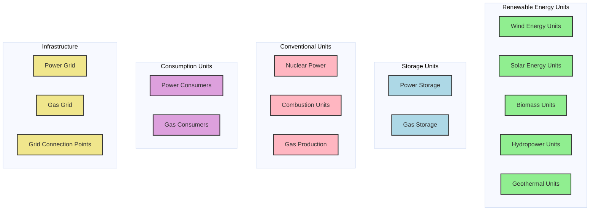

### Detailed Schema Analysis

#### 1. Renewable Energy Units

##### 1.1 Wind Energy (EinheitenWind.xsd)
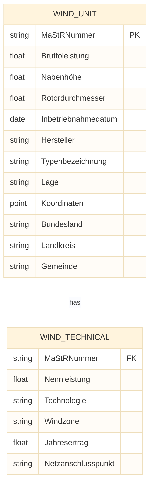

##### 1.2 Solar Energy (EinheitenSolar.xsd)
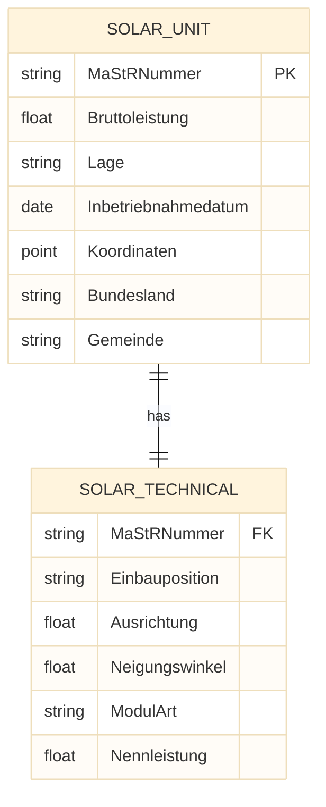

##### 1.3 Biomass Units (EinheitenBiomasse.xsd)
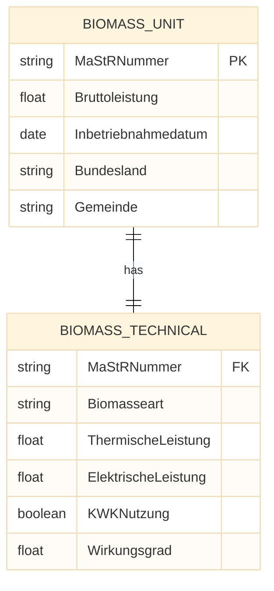

##### 1.4 Hydropower Units (EinheitenWasser.xsd)
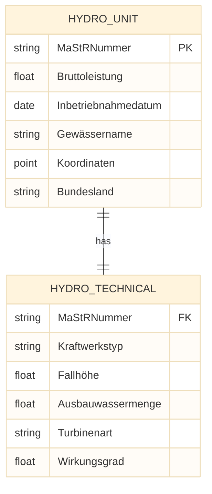

##### 1.5 Geothermal Units (EinheitenGeothermieGrubengasDruckentspannung.xsd)
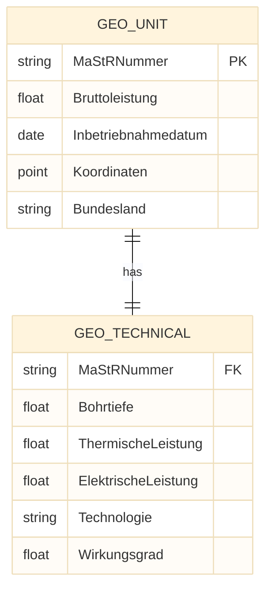

#### 2. Storage Systems

##### 2.1 Power Storage (EinheitenStromSpeicher.xsd)
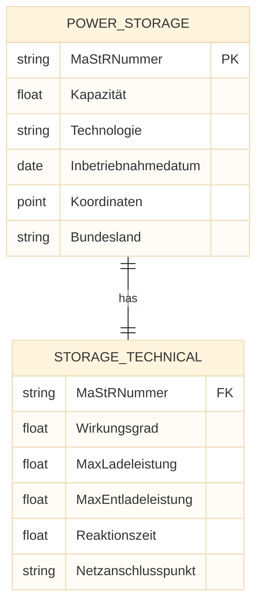

##### 2.2 Gas Storage (EinheitenGasSpeicher.xsd)
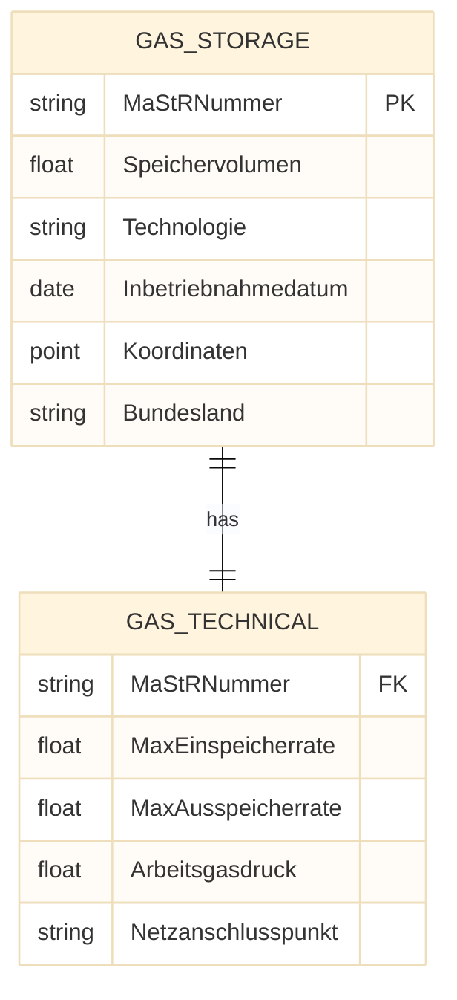

#### 3. Conventional Power Units

##### 3.1 Nuclear Power (EinheitenKernkraft.xsd)
```mermaid
%%{init: {'theme': 'base', 'themeVariables': { 'fontFamily': 'arial', 'fontSize': '16px', 'textColor': '#000000' }}}%%
erDiagram
    NUCLEAR_UNIT {
        string MaStRNummer PK
        float Bruttoleistung
        date Inbetriebnahmedatum
        point Koordinaten
        string Bundesland
    }
    
    NUCLEAR_TECHNICAL {
        string MaStRNummer FK
        string Reaktortyp
        float ThermischeLeistung
        float ElektrischeLeistung
        string Kühlsystem
        float Wirkungsgrad
    }

    NUCLEAR_UNIT ||--|| NUCLEAR_TECHNICAL : has
```

##### 3.2 Combustion Units (EinheitenVerbrennung.xsd)
```mermaid
%%{init: {'theme': 'base', 'themeVariables': { 'fontFamily': 'arial', 'fontSize': '16px', 'textColor': '#000000' }}}%%
erDiagram
    COMBUSTION_UNIT {
        string MaStRNummer PK
        float Bruttoleistung
        string Brennstoff
        date Inbetriebnahmedatum
        point Koordinaten
        string Bundesland
    }
    
    COMBUSTION_TECHNICAL {
        string MaStRNummer FK
        float ThermischeLeistung
        float ElektrischeLeistung
        string Technologie
        boolean KWKNutzung
        float Wirkungsgrad
    }

    COMBUSTION_UNIT ||--|| COMBUSTION_TECHNICAL : has
```

#### 4. Consumption Units

##### 4.1 Power Consumers (EinheitenStromVerbraucher.xsd)
```mermaid
%%{init: {'theme': 'base', 'themeVariables': { 'fontFamily': 'arial', 'fontSize': '16px', 'textColor': '#000000' }}}%%
erDiagram
    POWER_CONSUMER {
        string MaStRNummer PK
        float Jahresverbrauch
        string Verbrauchergruppe
        date Anschlussdatum
        point Koordinaten
        string Bundesland
    }
    
    CONSUMER_TECHNICAL {
        string MaStRNummer FK
        float Anschlussleistung
        string Spannungsebene
        string Netzanschlusspunkt
        string Lastprofil
    }

    POWER_CONSUMER ||--|| CONSUMER_TECHNICAL : has
```

##### 4.2 Gas Consumers (EinheitenGasverbraucher.xsd)
```mermaid
%%{init: {'theme': 'base', 'themeVariables': { 'fontFamily': 'arial', 'fontSize': '16px', 'textColor': '#000000' }}}%%
erDiagram
    GAS_CONSUMER {
        string MaStRNummer PK
        float Jahresverbrauch
        string Verbrauchergruppe
        date Anschlussdatum
        point Koordinaten
        string Bundesland
    }
    
    GAS_CONSUMER_TECH {
        string MaStRNummer FK
        float Anschlussleistung
        float Betriebsdruck
        string Netzanschlusspunkt
        string Lastprofil
    }

    GAS_CONSUMER ||--|| GAS_CONSUMER_TECH : has
```

#### 5. Infrastructure and Network

##### 5.1 Grid Components (Netze.xsd)
```mermaid
%%{init: {'theme': 'base', 'themeVariables': { 'fontFamily': 'arial', 'fontSize': '16px', 'textColor': '#000000' }}}%%
erDiagram
    GRID {
        string NetzID PK
        string Netzbetreiber
        string Netzart
        polygon Netzgebiet
        string Bundesland
    }
    
    GRID_TECHNICAL {
        string NetzID FK
        string Spannungsebene
        float Netzlänge
        int Anschlusspunkte
        float Übertragungskapazität
    }

    GRID ||--|| GRID_TECHNICAL : has
```

##### 5.2 Connection Points (Netzanschlusspunkte.xsd)
```mermaid
%%{init: {'theme': 'base', 'themeVariables': { 'fontFamily': 'arial', 'fontSize': '16px', 'textColor': '#000000' }}}%%
erDiagram
    CONNECTION_POINT {
        string AnschlusspunktID PK
        string NetzID FK
        point Koordinaten
        string Bundesland
        string Gemeinde
    }
    
    CONNECTION_TECHNICAL {
        string AnschlusspunktID FK
        string Spannungsebene
        float Anschlussleistung
        string Anschlussart
        string Messstelle
    }

    CONNECTION_POINT ||--|| CONNECTION_TECHNICAL : has
```

### Database Implementation Strategy

Based on the schema analysis, our database implementation will:

1. **Core Tables**
   - Create normalized tables for each unit type
   - Implement common fields across all units
   - Use PostGIS for spatial data
   - Implement proper indexing strategies

2. **Relationships**
   - Link units to locations
   - Connect to grid infrastructure
   - Map market participants
   - Track historical changes

3. **Technical Specifications**
   - Store technical parameters
   - Implement unit conversions
   - Handle measurement uncertainties
   - Track calibration data

4. **Time Series Data**
   - Store operational data
   - Track performance metrics
   - Monitor status changes
   - Record maintenance events

### Query Examples for Brandenburg Analysis

1. **Renewable Energy Distribution**
```sql
SELECT 
    g.gemeinde,
    COUNT(DISTINCT w.MaStRNummer) as wind_units,
    COUNT(DISTINCT s.MaStRNummer) as solar_units,
    COUNT(DISTINCT b.MaStRNummer) as biomass_units,
    SUM(w.Bruttoleistung) as wind_capacity,
    SUM(s.Bruttoleistung) as solar_capacity,
    SUM(b.Bruttoleistung) as biomass_capacity
FROM gemeinden g
LEFT JOIN EinheitenWind w ON g.gemeinde = w.Gemeinde
LEFT JOIN EinheitenSolar s ON g.gemeinde = s.Gemeinde
LEFT JOIN EinheitenBiomasse b ON g.gemeinde = b.Gemeinde
WHERE g.bundesland = 'Brandenburg'
GROUP BY g.gemeinde;
```

2. **Grid Connection Analysis**
```sql
SELECT 
    n.NetzID,
    n.Netzbetreiber,
    COUNT(a.AnschlusspunktID) as connection_points,
    SUM(a.Anschlussleistung) as total_capacity,
    ST_Area(n.Netzgebiet) as coverage_area
FROM Netze n
JOIN Netzanschlusspunkte a ON n.NetzID = a.NetzID
WHERE n.Bundesland = 'Brandenburg'
GROUP BY n.NetzID, n.Netzbetreiber;
```

3. **Renewable Potential Analysis**
```sql
WITH municipality_potential AS (
    SELECT 
        g.gemeinde,
        AVG(w.Windgeschwindigkeit) as avg_wind_speed,
        AVG(s.Globalstrahlung) as avg_solar_radiation,
        COUNT(b.BiomassePotential) as biomass_sources,
        ST_Area(g.geometry) as area_size
    FROM gemeinden g
    LEFT JOIN WindData w ON ST_Contains(g.geometry, w.location)
    LEFT JOIN SolarData s ON ST_Contains(g.geometry, s.location)
    LEFT JOIN BiomassData b ON ST_Contains(g.geometry, b.location)
    WHERE g.bundesland = 'Brandenburg'
    GROUP BY g.gemeinde, g.geometry
)
SELECT 
    gemeinde,
    (avg_wind_speed * 0.3 + 
     avg_solar_radiation * 0.3 + 
     biomass_sources * 0.2 + 
     area_size * 0.2) as potential_score
FROM municipality_potential
ORDER BY potential_score DESC;
```

### Data Quality Rules

1. **Validation Rules**
```typescript
interface ValidationRules {
    coordinates: {
        longitude: [-180, 180],
        latitude: [-90, 90]
    },
    power: {
        min: 0,
        max: 5000000 // 5 GW
    },
    dates: {
        min: "1900-01-01",
        max: "current_date"
    },
    strings: {
        maxLength: 255,
        allowedCharacters: "UTF-8"
    }
}
```

2. **Consistency Checks**
```sql
-- Check for overlapping facilities
SELECT 
    a.MaStRNummer,
    b.MaStRNummer,
    ST_Distance(a.Koordinaten, b.Koordinaten) as distance
FROM EinheitenWind a
JOIN EinheitenWind b ON 
    a.MaStRNummer < b.MaStRNummer AND
    ST_DWithin(a.Koordinaten, b.Koordinaten, 100)
WHERE a.Bundesland = 'Brandenburg';
```

### Performance Optimization

1. **Spatial Indexing**
```sql
CREATE INDEX idx_wind_location ON EinheitenWind USING GIST (Koordinaten);
CREATE INDEX idx_solar_location ON EinheitenSolar USING GIST (Koordinaten);
CREATE INDEX idx_biomass_location ON EinheitenBiomasse USING GIST (Koordinaten);
```

2. **Materialized Views**
```sql
CREATE MATERIALIZED VIEW mv_brandenburg_renewable_summary AS
SELECT 
    gemeinde,
    SUM(Bruttoleistung) as total_capacity,
    COUNT(*) as unit_count,
    ST_ConvexHull(ST_Collect(Koordinaten)) as coverage_area
FROM (
    SELECT Gemeinde as gemeinde, Bruttoleistung, Koordinaten FROM EinheitenWind
    UNION ALL
    SELECT Gemeinde, Bruttoleistung, Koordinaten FROM EinheitenSolar
    UNION ALL
    SELECT Gemeinde, Bruttoleistung, Koordinaten FROM EinheitenBiomasse
) all_units
WHERE Bundesland = 'Brandenburg'
GROUP BY gemeinde;
```

This comprehensive schema analysis and implementation strategy ensures:
1. Efficient data storage and retrieval
2. Accurate representation of all unit types
3. Support for complex spatial queries
4. Optimized performance for Brandenburg-specific analysis
5. Proper handling of relationships and dependencies

Would you like me to:
1. Provide more detailed queries for specific analysis scenarios?
2. Develop additional data quality rules?
3. Create more detailed technical specifications?
4. Design specific API endpoints for data access? 

## Query Processing Flow

### Example Query Analysis
"Where is a municipality with high renewable energy potential?"

### 1. Query Processing Pipeline

```mermaid
%%{init: {'theme': 'base', 'themeVariables': { 'fontFamily': 'arial', 'fontSize': '16px', 'textColor': '#000000' }}}%%
sequenceDiagram
    participant U as User Interface
    participant O as Orchestrator Agent
    participant A as Data Analyst Agent
    participant C as Data Collection Agent
    participant P as Data Processing Agent
    participant DB as Database Layer
    
    U->>O: Submit Query
    O->>A: Analyze Query Intent
    A->>A: Generate Analysis Plan
    A->>C: Request Data Collection
    C->>DB: Fetch Raw Data
    DB->>C: Return Data
    C->>P: Process Data
    P->>P: Apply Analytics
    P->>A: Return Results
    A->>O: Generate Visualization
    O->>U: Display Results

    Note over U,O: Natural Language Query
    Note over O,A: Intent Classification
    Note over A,C: Data Requirements
    Note over C,DB: Database Queries
    Note over P,A: Analytics & Scoring
    Note over O,U: Interactive Dashboard
```

### 2. Intent Analysis Flow

```mermaid
%%{init: {'theme': 'base', 'themeVariables': { 'fontFamily': 'arial', 'fontSize': '16px', 'textColor': '#000000' }}}%%
graph TB
    Query[Raw Query] --> NLP[NLP Processing]
    NLP --> Intent[Intent Classification]
    NLP --> Entities[Entity Extraction]
    NLP --> Context[Context Analysis]
    
    Intent --> DataNeeds[Data Requirements]
    Entities --> DataNeeds
    Context --> DataNeeds
    
    DataNeeds --> Plan[Analysis Plan]
    
    subgraph "Query Understanding"
        NLP
        Intent
        Entities
        Context
    end
    
    subgraph "Planning"
        DataNeeds
        Plan
    end

    style Query fill:#f9f,stroke:#333,stroke-width:2px,color:#000
    style NLP fill:#bbf,stroke:#333,stroke-width:2px,color:#000
    style Intent fill:#dfd,stroke:#333,stroke-width:2px,color:#000
    style Entities fill:#ffd,stroke:#333,stroke-width:2px,color:#000
    style Context fill:#fdf,stroke:#333,stroke-width:2px,color:#000
    style DataNeeds fill:#f9f,stroke:#333,stroke-width:2px,color:#000
    style Plan fill:#bbf,stroke:#333,stroke-width:2px,color:#000
```

### 3. Data Collection Strategy

```mermaid
%%{init: {'theme': 'base', 'themeVariables': { 'fontFamily': 'arial', 'fontSize': '16px', 'textColor': '#000000' }}}%%
graph TB
    Plan[Analysis Plan] --> Wind[Wind Data]
    Plan --> Solar[Solar Data]
    Plan --> Bio[Biomass Data]
    Plan --> Geo[Geographic Data]
    
    Wind --> Metrics[Energy Metrics]
    Solar --> Metrics
    Bio --> Metrics
    Geo --> Spatial[Spatial Analysis]
    
    Metrics --> Score[Potential Score]
    Spatial --> Score
    
    subgraph "Data Sources"
        Wind
        Solar
        Bio
        Geo
    end
    
    subgraph "Analysis"
        Metrics
        Spatial
        Score
    end

    style Plan fill:#f9f,stroke:#333,stroke-width:2px,color:#000
    style Wind fill:#bbf,stroke:#333,stroke-width:2px,color:#000
    style Solar fill:#dfd,stroke:#333,stroke-width:2px,color:#000
    style Bio fill:#ffd,stroke:#333,stroke-width:2px,color:#000
    style Geo fill:#fdf,stroke:#333,stroke-width:2px,color:#000
    style Metrics fill:#f9f,stroke:#333,stroke-width:2px,color:#000
    style Spatial fill:#bbf,stroke:#333,stroke-width:2px,color:#000
    style Score fill:#dfd,stroke:#333,stroke-width:2px,color:#000
```

### 4. Analysis Components

```mermaid
%%{init: {'theme': 'base', 'themeVariables': { 'fontFamily': 'arial', 'fontSize': '16px', 'textColor': '#000000' }}}%%
graph TB
    subgraph "Wind Potential"
        W1[Wind Speed Data]
        W2[Turbine Locations]
        W3[Height Analysis]
        W4[Terrain Features]
    end
    
    subgraph "Solar Potential"
        S1[Solar Radiation]
        S2[Panel Locations]
        S3[Roof Analysis]
        S4[Shading Factors]
    end
    
    subgraph "Biomass Potential"
        B1[Resource Availability]
        B2[Facility Locations]
        B3[Transport Routes]
        B4[Supply Chain]
    end
    
    subgraph "Infrastructure"
        I1[Grid Capacity]
        I2[Connection Points]
        I3[Transport Access]
        I4[Land Availability]
    end
    
    W1 & W2 & W3 & W4 --> WS[Wind Score]
    S1 & S2 & S3 & S4 --> SS[Solar Score]
    B1 & B2 & B3 & B4 --> BS[Biomass Score]
    I1 & I2 & I3 & I4 --> IS[Infrastructure Score]
    
    WS & SS & BS & IS --> FS[Final Score]

    style WS fill:#90EE90,stroke:#333,stroke-width:2px
    style SS fill:#FFD700,stroke:#333,stroke-width:2px
    style BS fill:#98FB98,stroke:#333,stroke-width:2px
    style IS fill:#87CEEB,stroke:#333,stroke-width:2px
    style FS fill:#FF69B4,stroke:#333,stroke-width:2px
```

### 5. Visualization Generation

```mermaid
%%{init: {'theme': 'base', 'themeVariables': { 'fontFamily': 'arial', 'fontSize': '16px', 'textColor': '#000000' }}}%%
graph TB
    Data[Analysis Results] --> Type[Visualization Type Selection]
    Type --> Map[Interactive Map]
    Type --> Chart[Statistical Charts]
    Type --> Table[Data Tables]
    
    Map --> Layers[Layer Management]
    Chart --> Config[Chart Configuration]
    Table --> Format[Data Formatting]
    
    Layers --> UI[User Interface]
    Config --> UI
    Format --> UI
    
    subgraph "Visualization Components"
        Map
        Chart
        Table
    end
    
    subgraph "Configuration"
        Layers
        Config
        Format
    end

    style Data fill:#f9f,stroke:#333,stroke-width:2px,color:#000
    style Type fill:#bbf,stroke:#333,stroke-width:2px,color:#000
    style Map fill:#dfd,stroke:#333,stroke-width:2px,color:#000
    style Chart fill:#ffd,stroke:#333,stroke-width:2px,color:#000
    style Table fill:#fdf,stroke:#333,stroke-width:2px,color:#000
    style UI fill:#f9f,stroke:#333,stroke-width:2px,color:#000
```

### 6. Dashboard Components

```mermaid
%%{init: {'theme': 'base', 'themeVariables': { 'fontFamily': 'arial', 'fontSize': '16px', 'textColor': '#000000' }}}%%
graph TB
    subgraph "Main View"
        M1[Interactive Map]
        M2[Municipality List]
        M3[Summary Statistics]
    end
    
    subgraph "Detail View"
        D1[Renewable Distribution]
        D2[Infrastructure Status]
        D3[Development Timeline]
    end
    
    subgraph "Analysis Tools"
        T1[Filtering Options]
        T2[Comparison Tools]
        T3[Export Functions]
    end
    
    M1 & M2 & M3 --> Detail[Detail Selection]
    Detail --> D1 & D2 & D3
    T1 & T2 & T3 --> Update[Update Views]
    Update --> M1 & M2 & M3

    style M1 fill:#90EE90,stroke:#333,stroke-width:2px
    style M2 fill:#FFD700,stroke:#333,stroke-width:2px
    style M3 fill:#98FB98,stroke:#333,stroke-width:2px
    style D1 fill:#87CEEB,stroke:#333,stroke-width:2px
    style D2 fill:#DDA0DD,stroke:#333,stroke-width:2px
    style D3 fill:#F0E68C,stroke:#333,stroke-width:2px
```

### Query Processing Steps

1. **Initial Query Processing**
   - Natural language understanding
   - Intent classification
   - Entity extraction
   - Context analysis

2. **Data Collection**
   - Identify required data sources
   - Generate database queries
   - Fetch raw data
   - Validate data completeness

3. **Data Processing**
   - Clean and normalize data
   - Apply transformations
   - Calculate metrics
   - Generate scores

4. **Analysis**
   - Apply scoring algorithms
   - Calculate rankings
   - Generate insights
   - Prepare visualizations

5. **Result Generation**
   - Create interactive map
   - Generate statistical charts
   - Prepare data tables
   - Build dashboard components

### Example Dashboard Components

1. **Main Map View**
   - Municipality boundaries
   - Heat map of potential scores
   - Existing facility locations
   - Grid infrastructure

2. **Statistical Analysis**
   - Renewable energy distribution
   - Capacity statistics
   - Growth trends
   - Comparison metrics

3. **Detail Panels**
   - Municipality details
   - Infrastructure status
   - Development timeline
   - Environmental factors

4. **Interactive Features**
   - Filtering options
   - Layer toggling
   - Drill-down capabilities
   - Export functions

This query processing flow ensures:
1. Comprehensive data analysis
2. Accurate potential assessment
3. Interactive visualization
4. User-friendly presentation
5. Detailed insights 

## Field Descriptions

### 1. Renewable Energy Units

#### 1.1 Wind Energy (EinheitenWind)
| German Field | English Description | Type | Notes |
|-------------|-------------------|------|-------|
| MaStRNummer | Master Data Registry Number | string | Primary identifier for the unit |
| Bruttoleistung | Gross Power Output | float | Total power output in MW |
| Nabenhöhe | Hub Height | float | Height of turbine hub in meters |
| Rotordurchmesser | Rotor Diameter | float | Diameter of rotor in meters |
| Inbetriebnahmedatum | Commissioning Date | date | Date when unit began operation |
| Hersteller | Manufacturer | string | Manufacturer of the wind turbine |
| Typenbezeichnung | Model Type | string | Specific model designation |
| Lage | Location Type | string | Onshore/Offshore designation |
| Koordinaten | Coordinates | point | Geographic location (lat/long) |
| Bundesland | Federal State | string | State where unit is located |
| Landkreis | District | string | Administrative district |
| Gemeinde | Municipality | string | Local municipality |

#### 1.2 Solar Energy (EinheitenSolar)
| German Field | English Description | Type | Notes |
|-------------|-------------------|------|-------|
| MaStRNummer | Master Data Registry Number | string | Primary identifier |
| Bruttoleistung | Gross Power Output | float | Total power output in kWp |
| Lage | Installation Location | string | Roof/Ground/Facade |
| Inbetriebnahmedatum | Commissioning Date | date | Start of operation |
| Koordinaten | Coordinates | point | Geographic location |
| Einbauposition | Installation Position | string | Mounting type |
| Ausrichtung | Orientation | float | Azimuth angle in degrees |
| Neigungswinkel | Tilt Angle | float | Panel tilt in degrees |
| ModulArt | Module Type | string | Technology type |
| Nennleistung | Nominal Power | float | Rated power output |

#### 1.3 Biomass Units (EinheitenBiomasse)
| German Field | English Description | Type | Notes |
|-------------|-------------------|------|-------|
| MaStRNummer | Master Data Registry Number | string | Primary identifier |
| Bruttoleistung | Gross Power Output | float | Total power output |
| Biomasseart | Biomass Type | string | Fuel category |
| ThermischeLeistung | Thermal Power | float | Heat output capacity |
| ElektrischeLeistung | Electrical Power | float | Electrical output |
| KWKNutzung | CHP Usage | boolean | Combined heat and power |
| Wirkungsgrad | Efficiency | float | Overall efficiency ratio |

### 2. Storage Systems

#### 2.1 Power Storage (EinheitenStromSpeicher)
| German Field | English Description | Type | Notes |
|-------------|-------------------|------|-------|
| MaStRNummer | Master Data Registry Number | string | Primary identifier |
| Kapazität | Storage Capacity | float | Total storage in MWh |
| Technologie | Technology Type | string | Storage technology |
| MaxLadeleistung | Max Charging Power | float | Maximum input power |
| MaxEntladeleistung | Max Discharging Power | float | Maximum output power |
| Reaktionszeit | Response Time | float | System response time |
| Wirkungsgrad | Efficiency | float | Round-trip efficiency |

#### 2.2 Gas Storage (EinheitenGasSpeicher)
| German Field | English Description | Type | Notes |
|-------------|-------------------|------|-------|
| MaStRNummer | Master Data Registry Number | string | Primary identifier |
| Speichervolumen | Storage Volume | float | Total gas volume |
| MaxEinspeicherrate | Max Injection Rate | float | Maximum input flow |
| MaxAusspeicherrate | Max Withdrawal Rate | float | Maximum output flow |
| Arbeitsgasdruck | Working Gas Pressure | float | Operating pressure |

### 3. Infrastructure

#### 3.1 Grid Components (Netze)
| German Field | English Description | Type | Notes |
|-------------|-------------------|------|-------|
| NetzID | Grid ID | string | Primary identifier |
| Netzbetreiber | Grid Operator | string | Operating company |
| Netzart | Grid Type | string | Power/Gas classification |
| Netzgebiet | Grid Area | polygon | Coverage area |
| Spannungsebene | Voltage Level | string | Operating voltage |
| Netzlänge | Grid Length | float | Total length in km |
| Übertragungskapazität | Transmission Capacity | float | Maximum capacity |

#### 3.2 Connection Points (Netzanschlusspunkte)
| German Field | English Description | Type | Notes |
|-------------|-------------------|------|-------|
| AnschlusspunktID | Connection Point ID | string | Primary identifier |
| NetzID | Grid ID | string | Associated grid |
| Koordinaten | Coordinates | point | Geographic location |
| Spannungsebene | Voltage Level | string | Connection voltage |
| Anschlussleistung | Connection Capacity | float | Maximum power |
| Anschlussart | Connection Type | string | Technical specification |
| Messstelle | Metering Point | string | Measurement location |

### 4. Consumption Units

#### 4.1 Power Consumers (EinheitenStromVerbraucher)
| German Field | English Description | Type | Notes |
|-------------|-------------------|------|-------|
| MaStRNummer | Master Data Registry Number | string | Primary identifier |
| Jahresverbrauch | Annual Consumption | float | Yearly usage in MWh |
| Verbrauchergruppe | Consumer Group | string | Usage classification |
| Anschlussleistung | Connection Capacity | float | Maximum power draw |
| Spannungsebene | Voltage Level | string | Connection voltage |
| Lastprofil | Load Profile | string | Usage pattern |

#### 4.2 Gas Consumers (EinheitenGasverbraucher)
| German Field | English Description | Type | Notes |
|-------------|-------------------|------|-------|
| MaStRNummer | Master Data Registry Number | string | Primary identifier |
| Jahresverbrauch | Annual Consumption | float | Yearly usage in m³ |
| Verbrauchergruppe | Consumer Group | string | Usage classification |
| Anschlussleistung | Connection Capacity | float | Maximum flow rate |
| Betriebsdruck | Operating Pressure | float | Working pressure |
| Lastprofil | Load Profile | string | Usage pattern |

### Common Fields Across All Units

| German Field | English Description | Type | Notes |
|-------------|-------------------|------|-------|
| DatumLetzteAktualisierung | Last Update Date | dateTime | Last modification |
| Registrierungsdatum | Registration Date | date | Initial registration |
| Status | Operational Status | string | Current state |
| Betreiber | Operator | string | Operating entity |
| Eigentümer | Owner | string | Legal owner |
| Genehmigungsnummer | Permit Number | string | Legal authorization |
| EEGAnlagenschlüssel | EEG Plant Key | string | Renewable energy law reference |
| KWKAnlagenschlüssel | CHP Plant Key | string | CHP law reference | 