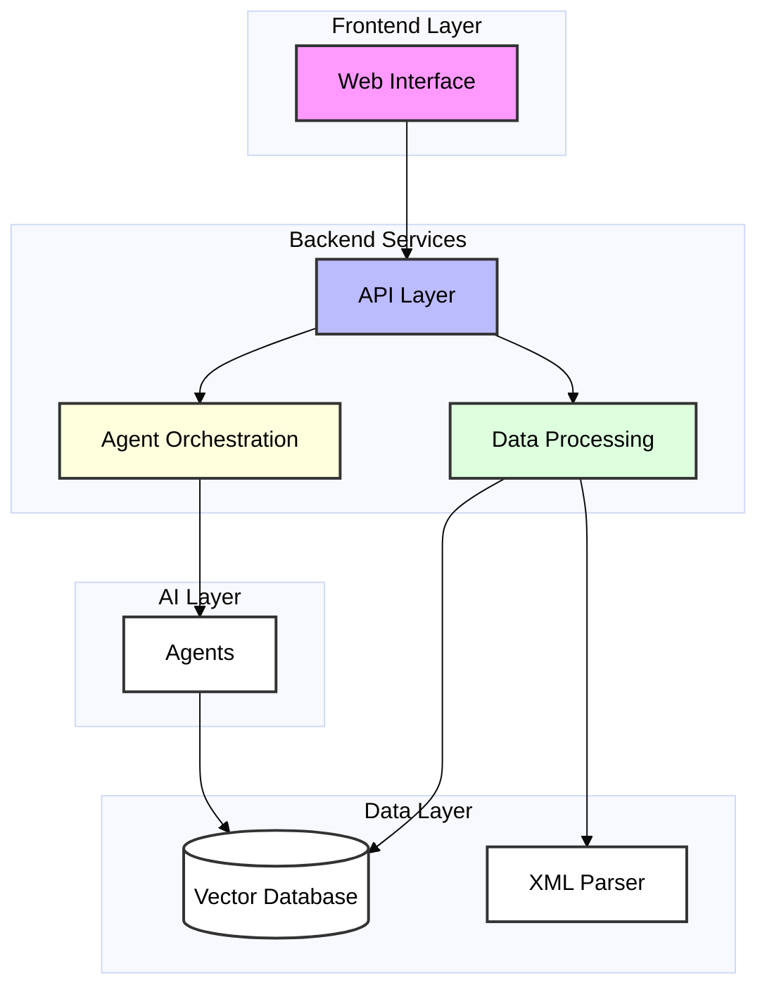
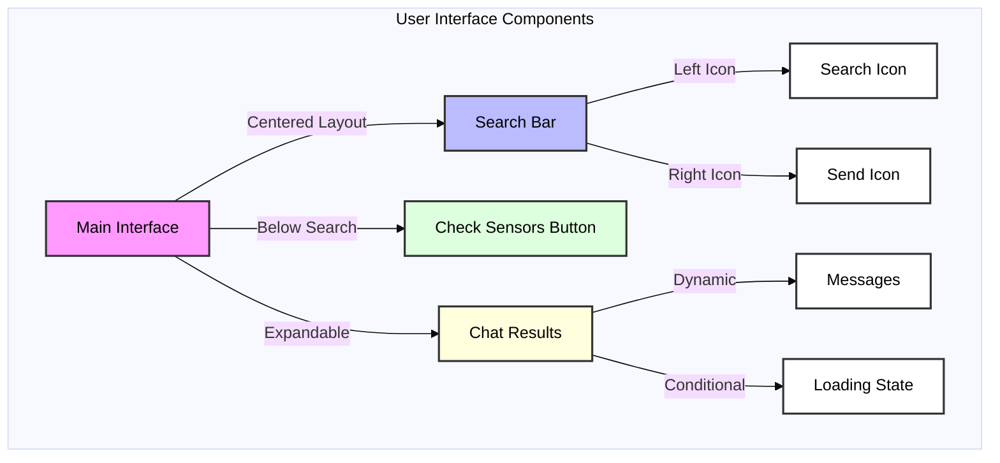
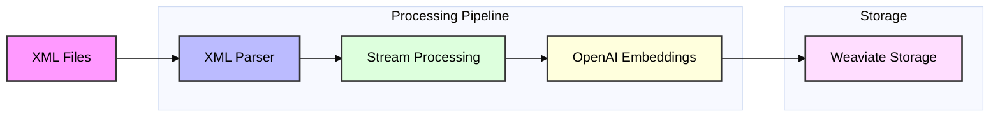
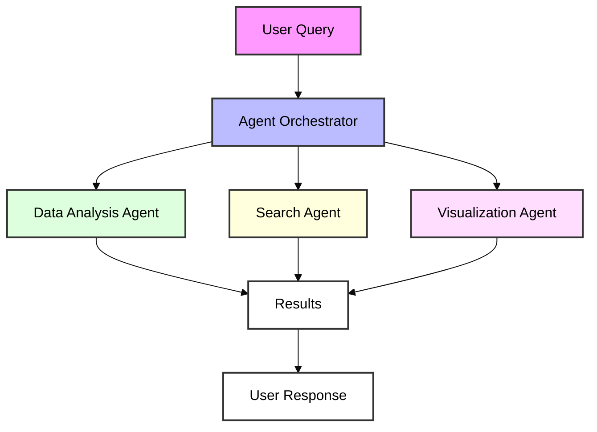
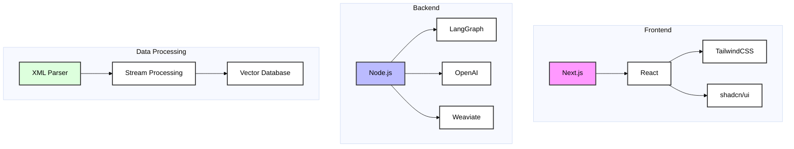

# MhatIoT Architecture

## Overview

MhatIoT is a modern IoT data analytics platform that provides a Google-like interface for querying and analyzing sensor data. The system is designed to be intuitive, responsive, and powerful, focusing on user experience while handling complex data processing under the hood.

## System Architecture

### High-Level Overview

## Component Details

### 1. Frontend Interface

The frontend is built with Next.js and follows Google's search interface design principles:

Key Features:
- Centered, Google-like search interface
- Expandable chat interface
- Responsive design
- Smooth transitions and animations
- Loading states and feedback

### 2. Data Processing Pipeline

Components:
- XML Parser for handling large network data files
- Streaming processing for efficient memory usage
- Vector embeddings for semantic search
- Weaviate for vector storage and retrieval

### 3. Agent Orchestration

Features:
- LangGraph for agent workflow management
- Specialized agents for different tasks
- Zod schemas for data validation
- Semantic search capabilities

## Implementation Details

### Key Files and Their Roles

1. `client/app/page.tsx`
   - Main interface component
   - Google-inspired search UI
   - Chat interface integration

2. `client/lib/data-processor.ts`
   - XML parsing logic
   - Vector database operations
   - Stream processing implementation

3. `client/lib/agents/orchestrator.ts`
   - Agent workflow management
   - Query routing and processing
   - Response generation

### Technology Stack

## Error Handling and Reliability

- Type safety throughout the application
- Proper error handling in data processing
- Loading states and user feedback
- Fallback mechanisms for failed operations

## Future Considerations

1. Scaling the vector database for larger datasets
2. Adding more specialized AI agents
3. Implementing real-time sensor data updates
4. Enhanced visualization capabilities
5. User authentication and access control 