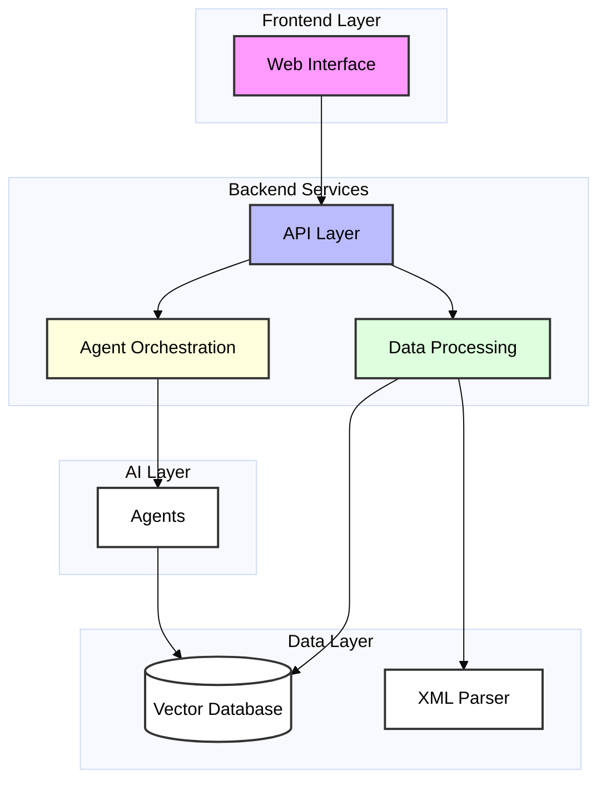
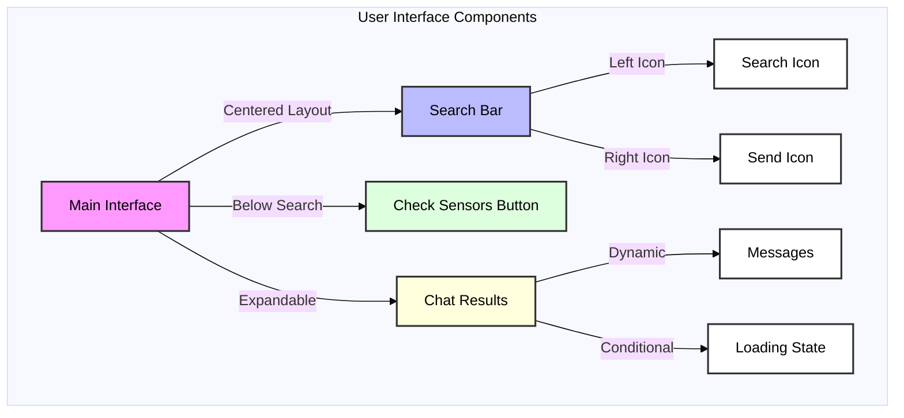
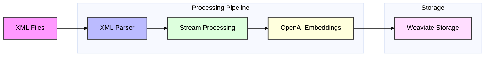
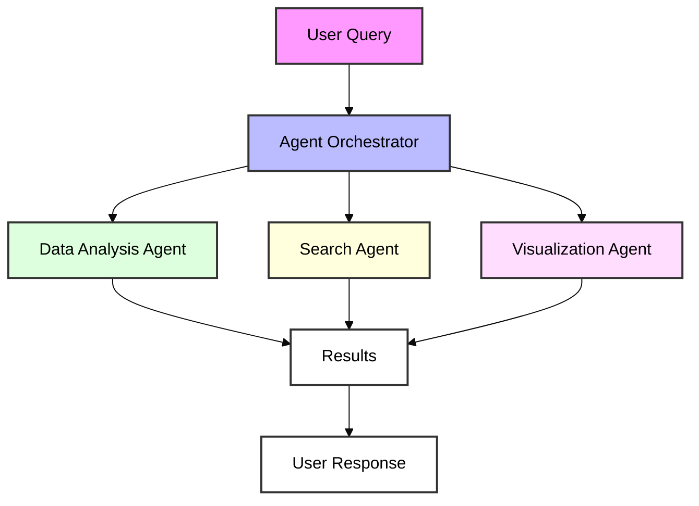
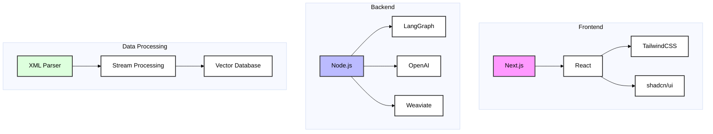
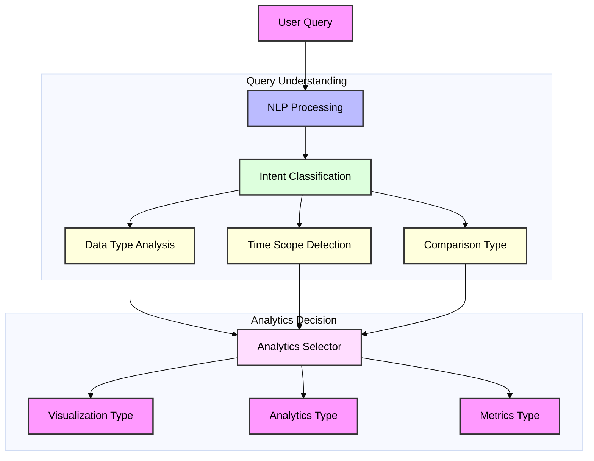
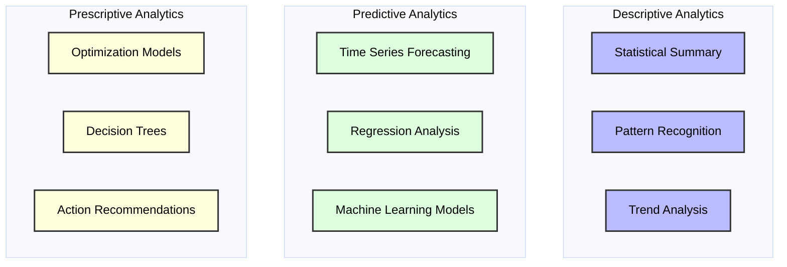
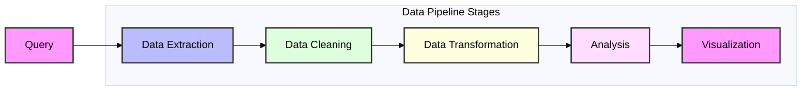

# MhatIoT Architecture

## Overview

MhatIoT is a modern IoT data analytics platform that provides a Google-like interface for querying and analyzing sensor data. The system is designed to be intuitive, responsive, and powerful, focusing on user experience while handling complex data processing under the hood.

## System Architecture

### High-Level Overview



## Component Details

### 1. Frontend Interface

The frontend is built with Next.js and follows Google's search interface design principles:



Key Features:
- Centered, Google-like search interface
- Expandable chat interface
- Responsive design
- Smooth transitions and animations
- Loading states and feedback

### 2. Data Processing Pipeline



Components:
- XML Parser for handling large network data files
- Streaming processing for efficient memory usage
- Vector embeddings for semantic search
- Weaviate for vector storage and retrieval

### 3. Agent Orchestration



Features:
- LangGraph for agent workflow management
- Specialized agents for different tasks
- Zod schemas for data validation
- Semantic search capabilities

## Implementation Details

### Key Files and Their Roles

1. `client/app/page.tsx`
   - Main interface component
   - Google-inspired search UI
   - Chat interface integration

2. `client/lib/data-processor.ts`
   - XML parsing logic
   - Vector database operations
   - Stream processing implementation

3. `client/lib/agents/orchestrator.ts`
   - Agent workflow management
   - Query routing and processing
   - Response generation

### Technology Stack



## Error Handling and Reliability

- Type safety throughout the application
- Proper error handling in data processing
- Loading states and user feedback
- Fallback mechanisms for failed operations

## Future Considerations

1. Scaling the vector database for larger datasets
2. Adding more specialized AI agents
3. Implementing real-time sensor data updates
4. Enhanced visualization capabilities
5. User authentication and access control

## Intelligent Analytics System

### Analytics Selection Flow



### Analytics Type Selection Matrix



### Visualization Selection Logic

```typescript
// visualization-selector.ts
interface AnalyticsContext {
  dataType: 'numerical' | 'categorical' | 'temporal' | 'geographical';
  timeScope: 'instant' | 'period' | 'trend';
  comparison: 'single' | 'multiple' | 'distribution';
  dimensionality: number;
}

interface VisualizationRecommendation {
  type: string;
  confidence: number;
  configuration: Record<string, any>;
}

class VisualizationSelector {
  private rules: Map<string, (ctx: AnalyticsContext) => number>;

  constructor() {
    this.rules = new Map([
      ['bar', this.evaluateBarChart],
      ['line', this.evaluateLineChart],
      ['pie', this.evaluatePieChart],
      ['map', this.evaluateMapChart],
      ['scatter', this.evaluateScatterPlot],
      ['heatmap', this.evaluateHeatmap],
    ]);
  }

  recommend(context: AnalyticsContext): VisualizationRecommendation {
    let bestScore = 0;
    let bestType = 'bar'; // default

    this.rules.forEach((evaluator, type) => {
      const score = evaluator(context);
      if (score > bestScore) {
        bestScore = score;
        bestType = type;
      }
    });

    return {
      type: bestType,
      confidence: bestScore,
      configuration: this.getConfiguration(bestType, context)
    };
  }

  private evaluateBarChart(ctx: AnalyticsContext): number {
    let score = 0;
    if (ctx.dataType === 'categorical' || ctx.dataType === 'numerical') score += 0.5;
    if (ctx.comparison === 'multiple') score += 0.3;
    if (ctx.dimensionality <= 2) score += 0.2;
    return score;
  }

  // ... similar evaluation methods for other chart types
}
```

### Data Processing Pipeline



### Weaviate Query Generation

```typescript
// query-generator.ts
interface QueryContext {
  intent: string;
  dataType: string;
  timeRange?: { start: Date; end: Date };
  metrics: string[];
  filters: Record<string, any>;
}

class WeaviateQueryGenerator {
  generateQuery(context: QueryContext): string {
    const baseQuery = `
    {
      Get {
        SensorData(
          ${this.generateFilters(context)}
        ) {
          ${this.generateFields(context)}
        }
      }
    }`;

    return baseQuery;
  }

  private generateFilters(context: QueryContext): string {
    const filters = [];
    
    if (context.timeRange) {
      filters.push(`
        where: {
          operator: And,
          operands: [
            { path: ["timestamp"], operator: GreaterThanEqual, valueDate: "${context.timeRange.start}" },
            { path: ["timestamp"], operator: LessThanEqual, valueDate: "${context.timeRange.end}" }
          ]
        }
      `);
    }

    // Add other filters based on context
    return filters.join(',\n');
  }

  private generateFields(context: QueryContext): string {
    return context.metrics.join('\n');
  }
}
```

### Analytics Processing Pipeline

```typescript
// analytics-processor.ts
interface AnalyticsRequest {
  query: string;
  context: QueryContext;
  visualizationType: string;
}

interface ProcessedData {
  raw: any[];
  processed: any[];
  metadata: Record<string, any>;
  visualization: VisualizationRecommendation;
}

class AnalyticsProcessor {
  async process(request: AnalyticsRequest): Promise<ProcessedData> {
    // 1. Extract data from Weaviate
    const rawData = await this.queryWeaviate(request.query);

    // 2. Clean and transform data
    const cleanData = this.cleanData(rawData);
    const transformedData = this.transformData(cleanData, request.context);

    // 3. Apply analytics
    const analyticsResult = await this.applyAnalytics(
      transformedData,
      request.context
    );

    // 4. Prepare visualization
    const vizConfig = this.prepareVisualization(
      analyticsResult,
      request.visualizationType
    );

    return {
      raw: rawData,
      processed: analyticsResult,
      metadata: this.extractMetadata(analyticsResult),
      visualization: vizConfig
    };
  }

  private async queryWeaviate(query: string): Promise<any[]> {
    const client = weaviate.client({
      scheme: 'http',
      host: 'localhost:8080',
    });

    const result = await client.graphql.get(query).do();
    return result.data.Get.SensorData;
  }

  private cleanData(data: any[]): any[] {
    return data.filter(item => {
      // Remove nulls, undefined, and invalid values
      return item && this.isValidSensorData(item);
    }).map(item => {
      // Normalize data formats
      return {
        ...item,
        timestamp: new Date(item.timestamp),
        value: Number(item.value)
      };
    });
  }

  private transformData(data: any[], context: QueryContext): any[] {
    // Apply transformations based on analytics type
    switch (context.intent) {
      case 'trend':
        return this.aggregateByTime(data);
      case 'comparison':
        return this.pivotData(data);
      case 'distribution':
        return this.calculateDistribution(data);
      default:
        return data;
    }
  }

  private async applyAnalytics(
    data: any[],
    context: QueryContext
  ): Promise<any[]> {
    switch (context.intent) {
      case 'predict':
        return this.applyPredictiveAnalytics(data);
      case 'prescribe':
        return this.applyPrescriptiveAnalytics(data);
      case 'describe':
        return this.applyDescriptiveAnalytics(data);
      default:
        return data;
    }
  }
}
```

### Frontend Visualization Component

```typescript
// visualization-component.tsx
import { useEffect, useRef } from 'react';
import * as d3 from 'd3';

interface VisualizationProps {
  data: ProcessedData;
  config: VisualizationRecommendation;
}

export const DynamicVisualization: React.FC<VisualizationProps> = ({
  data,
  config
}) => {
  const svgRef = useRef<SVGSVGElement>(null);

  useEffect(() => {
    if (!svgRef.current) return;

    // Clear previous visualization
    d3.select(svgRef.current).selectAll('*').remove();

    // Create new visualization based on type
    switch (config.type) {
      case 'bar':
        createBarChart(data, config, svgRef.current);
        break;
      case 'line':
        createLineChart(data, config, svgRef.current);
        break;
      case 'pie':
        createPieChart(data, config, svgRef.current);
        break;
      // ... other chart types
    }
  }, [data, config]);

  return (
    <div className="visualization-container">
      <svg ref={svgRef} width="100%" height="100%" />
    </div>
  );
};

function createBarChart(
  data: ProcessedData,
  config: VisualizationRecommendation,
  container: SVGSVGElement
) {
  const margin = { top: 20, right: 20, bottom: 30, left: 40 };
  const width = container.clientWidth - margin.left - margin.right;
  const height = container.clientHeight - margin.top - margin.bottom;

  const x = d3.scaleBand()
    .range([0, width])
    .padding(0.1);

  const y = d3.scaleLinear()
    .range([height, 0]);

  const svg = d3.select(container)
    .append('g')
    .attr('transform', `translate(${margin.left},${margin.top})`);

  // Set domains
  x.domain(data.processed.map(d => d.label));
  y.domain([0, d3.max(data.processed, d => d.value)]);

  // Add bars
  svg.selectAll('.bar')
    .data(data.processed)
    .enter().append('rect')
    .attr('class', 'bar')
    .attr('x', d => x(d.label))
    .attr('width', x.bandwidth())
    .attr('y', d => y(d.value))
    .attr('height', d => height - y(d.value));

  // Add axes
  svg.append('g')
    .attr('transform', `translate(0,${height})`)
    .call(d3.axisBottom(x));

  svg.append('g')
    .call(d3.axisLeft(y));
}
```

### Analytics Selection Process

```mermaid
%%{init: {'theme': 'base', 'themeVariables': { 'fontFamily': 'arial', 'fontSize': '16px', 'textColor': '#000000' }}}%%
sequenceDiagram
    participant U as User
    participant Q as Query Analyzer
    participant W as Weaviate
    participant P as Processor
    participant V as Visualizer

    U->>Q: Submit Query
    Q->>Q: Analyze Intent
    Q->>Q: Determine Analytics Type
    Q->>W: Generate & Execute Query
    W->>P: Raw Data
    P->>P: Clean & Transform
    P->>P: Apply Analytics
    P->>V: Processed Data
    V->>V: Select Visualization
    V->>U: Render Result

    style U fill:#f9f,stroke:#333,stroke-width:2px,color:#000
    style Q fill:#bbf,stroke:#333,stroke-width:2px,color:#000
    style W fill:#dfd,stroke:#333,stroke-width:2px,color:#000
    style P fill:#ffd,stroke:#333,stroke-width:2px,color:#000
    style V fill:#fdf,stroke:#333,stroke-width:2px,color:#000
```

This comprehensive system:
1. Analyzes user queries to determine intent and required analytics
2. Selects appropriate visualization types based on data characteristics
3. Generates optimized Weaviate queries
4. Processes data through cleaning and transformation pipelines
5. Applies the selected analytics methods
6. Renders dynamic visualizations using D3.js

The implementation includes:
- Type-safe interfaces and classes
- Modular and extensible architecture
- Comprehensive data processing pipeline
- Dynamic visualization generation
- Error handling and data validation

Would you like me to expand on any particular aspect of this system? 