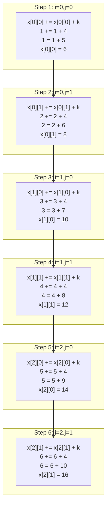
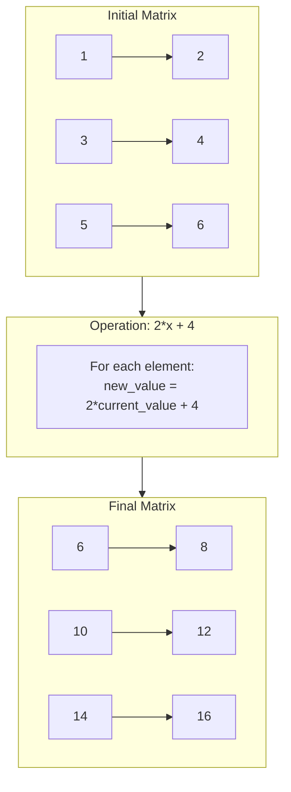
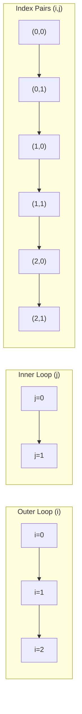

# Matrix Operation Explanation (M=3, N=2, K=4)

Let's walk through how the double loop operation `x[i][j] += x[i][j]+k` works on a 3x2 matrix.

## Initial Matrix
```
x[M][N] = [
    [1  2]
    [3  4]
    [5  6]
]
```

## Operation Breakdown
The operation `x[i][j] += x[i][j]+k` can be rewritten as:
`x[i][j] = x[i][j] + (x[i][j]+k)` = `2*x[i][j] + k`

With k=4, each element will be transformed as: `2*x[i][j] + 4`

## Step-by-Step Value Changes



## Matrix State After Each Step

### After Step 1 (i=0,j=0)
```
[
    [6  2]
    [3  4]
    [5  6]
]
```

### After Step 2 (i=0,j=1)
```
[
    [6  8]
    [3  4]
    [5  6]
]
```

### After Step 3 (i=1,j=0)
```
[
    [6  8]
    [10 4]
    [5  6]
]
```

### After Step 4 (i=1,j=1)
```
[
    [6  8]
    [10 12]
    [5  6]
]
```

### After Step 5 (i=2,j=0)
```
[
    [6  8]
    [10 12]
    [14 6]
]
```

### Final Matrix (After Step 6, i=2,j=1)
```
[
    [6  8]
    [10 12]
    [14 16]
]
```

## Operation Breakdown
For each position x[i][j]:
1. Take current value: x[i][j]
2. Add (current value + k): x[i][j] + k
3. Store result back in x[i][j]

Example for x[0][0]:
```
Current value = 1
Operation: x[0][0] += x[0][0] + k
          1 += 1 + 4
          1 = 1 + 5
Final value = 6
```

## Formula Pattern
- For any value v at position x[i][j]:
  - New value = v + (v + k)
  - New value = 2v + k
  - Example: If v=1 and k=4:
    - New value = 2(1) + 4 = 6

## Visual Representation of the Process



## Formula Applied to Each Position

| Position | Calculation | Result |
|----------|------------|--------|
| [0][0]   | 2*(1) + 4 | 6      |
| [0][1]   | 2*(2) + 4 | 8      |
| [1][0]   | 2*(3) + 4 | 10     |
| [1][1]   | 2*(4) + 4 | 12     |
| [2][0]   | 2*(5) + 4 | 14     |
| [2][1]   | 2*(6) + 4 | 16     |

## Code Implementation
```python
# Python implementation
M, N = 3, 2
k = 4

# Initialize matrix
x = [
    [1, 2],
    [3, 4],
    [5, 6]
]

# Perform operation
for i in range(M):
    for j in range(N):
        x[i][j] += x[i][j] + k

# Result is now stored in x
```

This operation effectively:
1. Doubles each element (because we add it to itself)
2. Adds the constant k (4) to each result
3. Maintains the matrix structure while transforming each element 

# Index Addition Pattern in Nested Loops (M=3, N=2)

## Loop Pattern
```
for i = 0 to M-1:
    for j = 0 to N-1:
        current_index = (i,j)
```

## Index Traversal Sequence
```
Step 1: i=0, j=0 → (0,0)
Step 2: i=0, j=1 → (0,1)
Step 3: i=1, j=0 → (1,0)
Step 4: i=1, j=1 → (1,1)
Step 5: i=2, j=0 → (2,0)
Step 6: i=2, j=1 → (2,1)
```

## Visual Index Flow



## Matrix Index Positions
```
[
    [(0,0)  (0,1)]
    [(1,0)  (1,1)]
    [(2,0)  (2,1)]
]
```

## Index Addition Pattern
1. j increments first (inner loop):
   - (0,0) → (0,1)
2. When j reaches N, i increments and j resets:
   - (0,1) → (1,0)
3. Pattern repeats until i reaches M

## Loop Counter Changes
```
i j  → Next Step
0,0  → j++
0,1  → j=0, i++
1,0  → j++
1,1  → j=0, i++
2,0  → j++
2,1  → Done
```

## Implementation Example
```python
M, N = 3, 2

for i in range(M):      # i: 0 to 2
    for j in range(N):  # j: 0 to 1
        print(f"Current index: ({i},{j})")
```

## Key Points
1. Inner loop (j) completes fully for each outer loop (i) value
2. When j reaches N, it resets to 0 and i increments
3. Total iterations = M × N = 3 × 2 = 6 pairs
4. Pattern follows row-major order (complete each row before moving to next) 

# Python Implementation

## Complete Code
```python
# Initialize parameters
M, N = 3, 2  # Matrix dimensions
k = 4        # Constant value to add

# Initialize the matrix
x = [
    [1, 2],
    [3, 4],
    [5, 6]
]

print("Initial Matrix:")
for row in x:
    print(row)

# Perform the operation x[i][j] += x[i][j] + k
for i in range(M):
    for j in range(N):
        x[i][j] += x[i][j] + k
        print(f"\nStep i={i}, j={j}:")
        print(f"Operation: x[{i}][{j}] += x[{i}][{j}] + {k}")
        print(f"Current matrix:")
        for row in x:
            print(row)

print("\nFinal Matrix:")
for row in x:
    print(row)
```

## Output
```
Initial Matrix:
[1, 2]
[3, 4]
[5, 6]

Step i=0, j=0:
Operation: x[0][0] += x[0][0] + 4
Current matrix:
[6, 2]
[3, 4]
[5, 6]

Step i=0, j=1:
Operation: x[0][1] += x[0][1] + 4
Current matrix:
[6, 8]
[3, 4]
[5, 6]

Step i=1, j=0:
Operation: x[1][0] += x[1][0] + 4
Current matrix:
[6, 8]
[10, 4]
[5, 6]

Step i=1, j=1:
Operation: x[1][1] += x[1][1] + 4
Current matrix:
[6, 8]
[10, 12]
[5, 6]

Step i=2, j=0:
Operation: x[2][0] += x[2][0] + 4
Current matrix:
[6, 8]
[10, 12]
[14, 6]

Step i=2, j=1:
Operation: x[2][1] += x[2][1] + 4
Current matrix:
[6, 8]
[10, 12]
[14, 16]

Final Matrix:
[6, 8]
[10, 12]
[14, 16]
```

## Alternative Implementation (Using NumPy)
```python
import numpy as np

# Initialize parameters
M, N = 3, 2
k = 4

# Create matrix using NumPy
x = np.array([[1, 2],
              [3, 4],
              [5, 6]])

print("Initial Matrix:")
print(x)

# Perform operation (vectorized)
x += x + k

print("\nFinal Matrix:")
print(x)
```

## NumPy Output
```
Initial Matrix:
[[1 2]
 [3 4]
 [5 6]]

Final Matrix:
[[ 6  8]
 [10 12]
 [14 16]]
```

## Key Points About the Code
1. The basic implementation uses nested loops to:
   - Access each element using indices i, j
   - Apply the operation x[i][j] += x[i][j] + k
   - Print intermediate steps

2. The NumPy implementation:
   - More concise using vectorized operations
   - Same result but faster for larger matrices
   - No explicit loops needed

3. Both versions produce identical results:
   - Each element is doubled
   - k (4) is added to each element
   - Operation is applied element-wise 