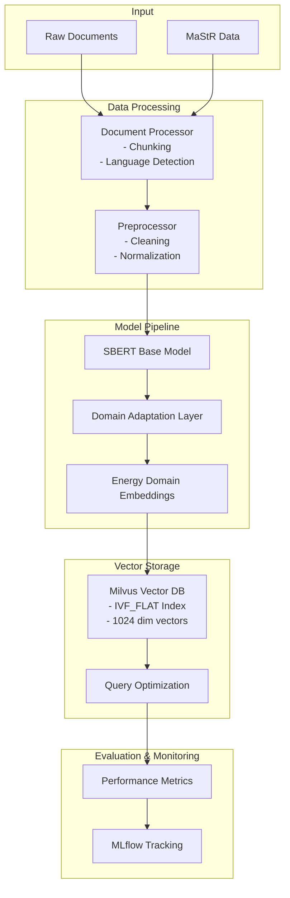

# AI and Data Science Architecture

## Project Structure
```
data_ai/
├── src/
│   ├── models/              # PyTorch model definitions
│   │   ├── embeddings.py    # SBERT and custom embedding models
│   │   ├── llm.py          # LLM integration and fine-tuning
│   │   └── evaluation.py    # Model evaluation metrics
│   ├── data/
│   │   ├── preprocessing.py # Data cleaning and preprocessing
│   │   ├── vectorization.py # Vector conversion utilities
│   │   └── augmentation.py  # Data augmentation strategies
│   ├── vector_db/
│   │   ├── milvus_client.py # Milvus database operations
│   │   ├── indexing.py      # Vector indexing implementations
│   │   └── query.py         # Query optimization
│   └── utils/
│       ├── metrics.py       # Performance measurement
│       ├── visualization.py  # Result visualization
│       └── logging.py       # Experiment logging
├── experiments/
│   ├── configs/             # Experiment configurations
│   ├── notebooks/           # Jupyter notebooks for analysis
│   └── results/             # Experimental results
├── tests/                   # Unit and integration tests
└── requirements.txt         # Project dependencies
```

## System Architecture

The following diagram illustrates the high-level architecture and data flow of the system:



## Core Components

### 1. Model Architecture

#### Embedding Models
- SBERT implementation for 1024-dimensional embeddings
- Custom embedding layers for domain adaptation
- Multi-lingual support for German-English processing

```python
# src/models/embeddings.py
class EnergyDomainEmbedding(nn.Module):
    def __init__(self, base_model='all-roberta-large-v1'):
        self.sbert = SentenceTransformer(base_model)
        self.domain_adapter = DomainAdaptationLayer(1024)
```

#### LLM Integration
- Fine-tuning pipeline for domain-specific tasks
- Integration with Vicuna-13B for evaluation
- Custom loss functions for domain adaptation

### 2. Vector Database Integration

#### Milvus Configuration
- IVF_FLAT index configuration
- 1024-dimensional vector space
- Optimized for energy infrastructure queries

```python
# src/vector_db/milvus_client.py
class MilvusClient:
    def __init__(self):
        self.collection = Collection(
            name="energy_vectors",
            dimension=1024,
            index_type=IndexType.IVF_FLAT,
            metric_type=MetricType.L2
        )
```

#### Indexing Strategy
- Clustering implementation (k-means)
- Distance metrics optimization
- Query pattern analysis

### 3. Data Processing Pipeline

#### Document Processing
- Chunk size: 500 words
- Overlap: 20 words
- Language detection and routing
- MaStR data structure parsing

```python
# src/data/preprocessing.py
class DocumentProcessor:
    def chunk_document(self, text, chunk_size=500, overlap=20):
        # Implementation for document chunking
        pass

    def process_mastr_data(self, data):
        # MaStR specific processing
        pass
```

#### Vector Generation
- Batch processing for efficiency
- Error handling and validation
- Quality metrics calculation

### 4. Experiment Framework

#### Configuration Management
```yaml
# experiments/configs/embedding_experiment.yaml
model:
  base_model: all-roberta-large-v1
  embedding_dim: 1024
  domain_adaptation: true

vector_db:
  index_type: IVF_FLAT
  nlist: 1024
  nprobe: 16

training:
  batch_size: 32
  learning_rate: 1e-5
  epochs: 10
```

#### Evaluation Metrics
- Query response time
- Embedding quality metrics
- Domain-specific accuracy measures
- Cross-lingual performance

### 5. Performance Optimization

#### GPU Utilization
- Batch size optimization
- Memory management
- Multi-GPU support

#### Database Optimization
- Index tuning
- Query caching
- Connection pooling

## Implementation Guidelines

### 1. Setup and Installation
```bash
# Create virtual environment
python -m venv venv
source venv/bin/activate

# Install dependencies
pip install -r requirements.txt

# Initialize vector database
python src/vector_db/init_db.py
```

### 2. Training Pipeline
```python
# Example training workflow
from src.models import EnergyDomainEmbedding
from src.data import DocumentProcessor
from src.vector_db import MilvusClient

# Initialize components
model = EnergyDomainEmbedding()
processor = DocumentProcessor()
db = MilvusClient()

# Training loop
for epoch in range(epochs):
    for batch in data_loader:
        embeddings = model(batch)
        loss = criterion(embeddings)
        optimizer.zero_grad()
        loss.backward()
        optimizer.step()
```

### 3. Evaluation Process
```python
# Example evaluation workflow
from src.models import Evaluator
from src.utils import metrics

evaluator = Evaluator(model, vicuna_model)
results = evaluator.evaluate_batch(test_data)
metrics.calculate_performance(results)
```

## Monitoring and Logging

### 1. Experiment Tracking
- MLflow integration for experiment tracking
- Metrics visualization
- Model versioning

### 2. Performance Monitoring
- Resource utilization tracking
- Query performance logging
- Error rate monitoring

## Development Workflow

1. **Experiment Design**
   - Define hypothesis
   - Set up configuration
   - Prepare evaluation criteria

2. **Implementation**
   - Develop model components
   - Implement data pipeline
   - Set up vector database

3. **Training**
   - Execute training pipeline
   - Monitor progress
   - Log results

4. **Evaluation**
   - Run evaluation metrics
   - Compare with baselines
   - Document findings

5. **Optimization**
   - Analyze bottlenecks
   - Implement improvements
   - Validate changes

## Hardware Requirements and Performance Estimates

### Dataset Characteristics
- Total data size: 42 GB
- Document chunking: 500 words per chunk, 20-word overlap
- Embedding dimensions: 1024
- Estimated number of chunks: ~3.36M

### Memory Requirements
- SBERT (RoBERTa-large) base model: ~1.2 GB
- Domain adaptation layer: ~4 MB
- Vector size: 4 KB per embedding
- Processing pipeline overhead: ~2 GB

### GPU Performance Estimates

#### NVIDIA RTX 4090 (24 GB VRAM)
```
Configuration:
- Batch size: 64
- Processing speed: ~250 chunks/second
- Time per epoch: ~3.7 hours

Advantages:
- Best price/performance ratio
- Sufficient VRAM for our workload
- Good for development and testing

Limitations:
- May require gradient checkpointing for larger batches
```

#### NVIDIA A100 (40/80 GB VRAM)
```
Configuration:
- Batch size: 128 (40GB) / 256 (80GB)
- Processing speed: ~500-800 chunks/second
- Time per epoch: ~1.2-2 hours

Advantages:
- Highest training performance
- Supports very large batch sizes
- Ideal for production training

Limitations:
- Higher cost
- May be overkill for dataset size
```

#### NVIDIA V100 (16/32 GB VRAM)
```
Configuration:
- Batch size: 32 (16GB) / 64 (32GB)
- Processing speed: ~200-400 chunks/second
- Time per epoch: ~2.3-4.6 hours

Advantages:
- Good balance of performance/cost
- Widely available in cloud services
- Proven in production environments

Limitations:
- Older architecture
- Less efficient than A100/4090
```

#### NVIDIA RTX 3090 (24 GB VRAM)
```
Configuration:
- Batch size: 64
- Processing speed: ~200 chunks/second
- Time per epoch: ~4.7 hours

Advantages:
- Good availability
- Decent performance
- Suitable for development

Limitations:
- Less efficient than 4090
```

### Optimization Strategies

1. **Distributed Training**
   - Multi-GPU training support
   - Gradient accumulation for larger effective batch sizes
   - Data parallel training across machines

2. **Memory Optimization**
   - Mixed precision training (FP16)
   - Gradient checkpointing
   - Efficient data loading pipeline

3. **Cloud Considerations**
   - Spot instance usage for cost optimization
   - Auto-scaling for distributed training
   - Checkpoint management for fault tolerance

### Recommendations

1. **Development Environment**
   - Single RTX 4090
   - Focus on rapid iteration and testing
   - Local development with sample dataset

2. **Production Training**
   - 2-4 RTX 4090s in parallel or 1-2 A100s
   - Distributed training setup
   - Regular checkpointing and monitoring

3. **Cloud Setup**
   - V100 instances for cost-effective training
   - Spot instances for non-critical training
   - Reserved instances for production workloads

## Dependencies

```
# requirements.txt
torch>=1.9.0
sentence-transformers>=2.2.0
pymilvus>=2.0.0
mlflow>=1.20.0
pandas>=1.3.0
numpy>=1.21.0
pytest>=6.2.5
```
